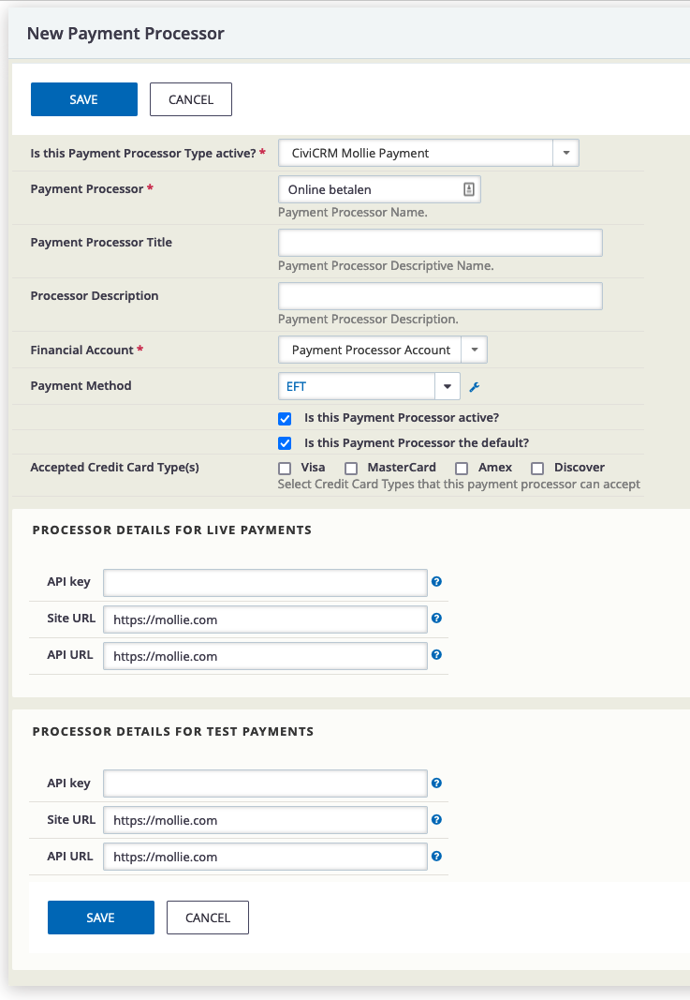

# be.ctrl.molliepayment

Everything functionally related to integrating Mollie payment provider in CiviCRM.

The extension is licensed under [AGPL-3.0](LICENSE.txt).

## Requirements

* PHP v7.4+
* CiviCRM v5.40+

## Installation (Web UI)

Learn more about installing CiviCRM extensions in the [CiviCRM Sysadmin Guide](https://docs.civicrm.org/sysadmin/en/latest/customize/extensions/).

## Development

| Id | Status      |
|----|-------------|
| 1  | Completed   |
| 2  | Pending     |
| 3  | Cancelled   |
| 4  | Failed      |
| 5  | In Progress |
| 6  | Overdue     |

## Links

- https://docs.civicrm.org/dev/en/latest/extensions/payment-processors/create
- https://stackoverflow.com/questions/53912401/add-cancel-url-mollie-payment

## Known Issues

(* FIXME *)
